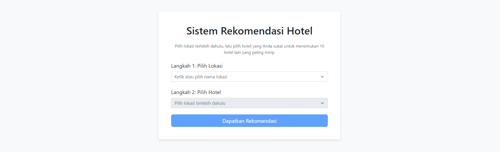

# Sistem Rekomendasi Hotel Berbasis Konten (Content-Based Filtering)

Proyek ini mendemonstrasikan pembuatan sistem rekomendasi hotel dari awal hingga menjadi sebuah aplikasi web interaktif. Prosesnya mencakup pengumpulan data dari situs Traveloka menggunakan Selenium, analisis dan pemodelan data di Jupyter Notebook, hingga deployment sebagai aplikasi web menggunakan Flask dan Bootstrap 5.

Tujuan utama dari sistem ini adalah untuk merekomendasikan hotel kepada pengguna berdasarkan kemiripan konten (lokasi, fasilitas, tipe properti) dengan hotel lain yang mereka sukai.



---

## 🚀 Alur Kerja Proyek

Proyek ini dibagi menjadi 4 tahap utama:

1.  **Pengumpulan Data (Scraping):** Mengambil data mentah hotel dari situs web dinamis menggunakan `Selenium`.
2.  **Analisis & Pemodelan (Notebook):** Menjelajahi, membersihkan, dan membangun logika model rekomendasi menggunakan `Jupyter Notebook`.
3.  **Ekspor Model (Production Prep):** Menyimpan model dan data yang sudah diproses agar siap digunakan oleh aplikasi web.
4.  **Aplikasi Web (Deployment):** Menjalankan server `Flask` untuk melayani model sebagai aplikasi web interaktif.

---

## 🛠️ Prasyarat (Prerequisites)

Sebelum memulai, pastikan Anda telah menginstal Python (disarankan versi 3.8 atau lebih baru) dan `pip` di sistem Anda. Anda juga memerlukan browser Google Chrome untuk proses scraping dengan Selenium.

### Struktur Folder Proyek

Pastikan struktur folder proyek Anda terlihat seperti ini:

```
/ProyekRekomendasiHotel
├── scraper.py                      # <-- Tahap 1: Scraper Selenium
├── Rekomendasi_Hotel.ipynb         # <-- Tahap 2: Analisis & Model
├── proc_and_export.py              # <-- Tahap 3: Ekspor Model
├── app.py                          # <-- Tahap 4: Aplikasi Flask
|
├── data_hotel_lengkap_final.csv    # (Akan dibuat oleh scraper)
|
├── models/                         # (Akan dibuat oleh skrip ekspor)
│
└───templates/
├── index.html
└── recommendations.html
```

### Instalasi Library

Buka terminal atau command prompt di dalam folder proyek Anda dan instal semua library yang dibutuhkan dengan menjalankan perintah berikut:

```bash
pip install pandas numpy scikit-learn selenium webdriver-manager flask matplotlib seaborn sastrawi
```

## 📖 Panduan Penggunaan

Ikuti langkah-langkah berikut secara berurutan.

#### Tahap 1: Pengumpulan Data dengan Scraper

Tahap ini menggunakan Selenium untuk membuka browser Chrome secara otomatis, melakukan scrolling untuk memuat semua data hotel, dan menyimpannya ke dalam file CSV.

1. Untuk menjalankan scraper, buka terminal dan jalankan perintah:

   ```
   python scraper.py
   ```

2. Setelah itu, sebuah jendela browser Chrome akan terbuka. Jangan tutup atau berinteraksi dengan jendela ini. Biarkan skrip berjalan dan melakukan scrolling secara otomatis. Proses ini bisa memakan waktu beberapa menit tergantung koneksi internet Anda. Jika muncul CAPTCHA, selesaikan di browser, lalu tekan Enter di terminal untuk melanjutkan.
3. Hasil: Setelah selesai, sebuah file bernama data_hotel_lengkap_final.csv akan tercipta di folder proyek Anda. File ini berisi data mentah yang akan kita olah.

#### Tahap 2: Analisis & Pemodelan di Jupyter Notebook

Tahap ini bersifat eksploratif. Tujuannya adalah untuk memahami data dan membangun logika model rekomendasi.

1. Jalankan Jupyter: Buka terminal dan jalankan perintah:
   ```
   jupyter notebook
   ```
2. Buka Notebook: Browser Anda akan membuka antarmuka Jupyter. Buka file Rekomendasi_Hotel.ipynb.
3. Jalankan Sel: Jalankan setiap sel kode secara berurutan dari atas ke bawah untuk melihat proses pembersihan data, visualisasi, pembuatan fitur, hingga pengujian fungsi rekomendasi. Tahap ini sangat penting untuk memahami "mengapa" dan "bagaimana" model ini bekerja.

#### Tahap 3: Menyiapkan Model untuk Produksi

Setelah kita puas dengan logika model di notebook, kita perlu menyiapkannya agar bisa digunakan oleh aplikasi web dengan efisien.

1. Jalankan Skrip Ekspor: Buka terminal dan jalankan perintah:

   ```
   python proc_and_export.py
   ```

2. Hasil: Perintah ini akan membuat sebuah folder baru bernama models/. Di dalamnya akan ada dua file:

- `processed_hotels_df.pkl`: Berisi DataFrame pandas dengan data hotel yang sudah bersih.
- `cosine_sim_matrix.pkl`: Berisi matriks kemiripan yang sudah dihitung sebelumnya.
  Sekarang, "otak" dari sistem rekomendasi kita sudah siap pakai.

#### Tahap 4: Menjalankan Aplikasi Web

Ini adalah tahap akhir di mana kita menghidupkan aplikasi web interaktif.

1. Jalankan Server Flask: Buka terminal dan jalankan perintah:

   ```
   python app.py
   ```

2. Lihat Output Terminal: Anda akan melihat pesan yang menandakan server sedang berjalan, seperti:
   ```
   * Running on [http://127.0.0.1:5000](http://127.0.0.1:5000)
   * Press CTRL+C to quit
   ```
3. Buka Aplikasi: Buka browser web favorit Anda (Chrome, Firefox, dll.) dan kunjungi alamat `http://127.0.0.1:5000`.
4. Gunakan Aplikasi:

- Pilih lokasi dari dropdown pertama.
- Dropdown kedua akan terisi secara dinamis dengan hotel-hotel di lokasi tersebut. Pilih salah satu hotel.
- Klik tombol "Dapatkan Rekomendasi".
- Aplikasi akan menampilkan 10 hotel lain yang paling mirip.

Untuk menghentikan server, kembali ke terminal dan tekan CTRL + C.
